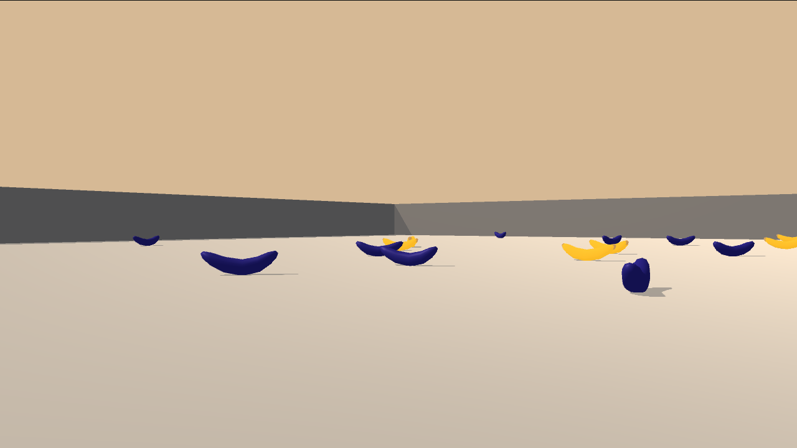

# Deep Reinforcement Learning - Banana Collector Project
Implementation of DQN Agent for "Banana Collection" project in Udacity's [Deep Reinforcement Learning Nanodegree](https://www.udacity.com/course/deep-reinforcement-learning-nanodegree--nd893).

By Sebastian Castro, 2020

---

## Project Introduction

This is a variant of the Banana Collector environment for the [Unity Machine Learning Agents Toolkit (ml-agents)](https://github.com/Unity-Technologies/ml-agents)

The environment consists of:
* **State:** A 37-dimension array that contains the agent's velocity plus ray-based perception of objects in the field of view
* **Actions:** 4 possible discrete actions corresponding to Forward, Backward, Turn Left, and Turn Right
* **Reward:** The agent is awarded `+1` for picking up a yellow banana and `-1` for a blue banana

As per the project specification, an agent is considered to have "solved" the problem if the average final reward over a 100-episode window exceeds `13`.

To see more details about the RL agent implementation, and training results, refer to the [Report](Report.md) included in this repository.

---

## Getting Started

To get started with this project, first you should perform the setup steps in the [Udacity Deep Reinforcement Learning Nanodegree Program GitHub repository](https://github.com/udacity/deep-reinforcement-learning). Namely, you should

1. Install [Conda](https://docs.conda.io/en/latest/) and create a Python 3.6 virtual environment
2. Install [OpenAI Gym](https://github.com/openai/gym)
3. Clone the [Udacity repo]((https://github.com/udacity/deep-reinforcement-learning)) and install the Python requirements included
4. Download the Banana World Unity files appropriate for your operating system and architecture ([Linux](https://s3-us-west-1.amazonaws.com/udacity-drlnd/P1/Banana/Banana_Linux.zip), [Mac OSX](https://s3-us-west-1.amazonaws.com/udacity-drlnd/P1/Banana/Banana.app.zip), [Win32](https://s3-us-west-1.amazonaws.com/udacity-drlnd/P1/Banana/Banana_Windows_x86.zip), [Win64](https://s3-us-west-1.amazonaws.com/udacity-drlnd/P1/Banana/Banana_Windows_x86_64.zip))

Once you have performed this setup, you should be ready to run the [`banana_world_dqn.ipynb`](banana_world_dqn.ipynb) Jupyter Notebook in this repo. This notebook contains all the steps needed to define and train a DQN Agent to solve this environment.