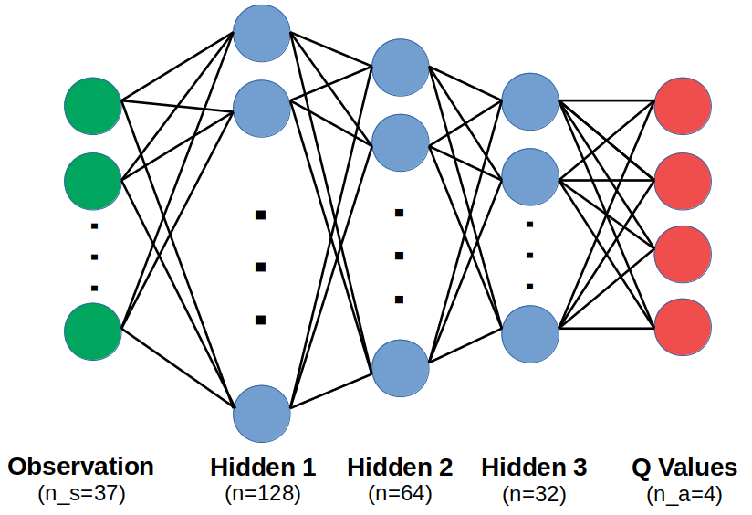

# Banana Collector Project - Technical Report
By Sebastian Castro, 2020

---

## Learning Algorithm
### Approach

For this project, we implemented the standard [Deep Q-Network (DQN)](https://arxiv.org/abs/1312.5602) algorithm.

This firstly consists of creating a neural network as a trainable function approximator that accepts a state as input and returns an estimate of the state-action value (or Q) for that state. DQN works with discrete actions, so its inference step involves estimating the Q values for a given state at all the possible actions and picking the action that is expected to give the maximum long-term reward.

To train the network, we create an agent that collects experiences from interacting with the environment. The general idea is as follows:

1. The Deep Q-Network is initialized with some weights
2. Using the network with its current weights (plus some exploration strategy), the agent will choose an action which takes it to a new state
3. This tuple of **(state, action, reward, new_state)** is added to an experience buffer
4. At some frequency, the agent will take a training step. This involves sampling a mini-batch at random from the experience buffer (which helps remove correlated experiences) and using the difference between expected and observed state-action values (Q-values) to define a loss function that can help train the network via backpropagation.
5. In practice, DQN can be unstable, so the use of a target network is common and part of this implementation. Here, the target network is updated more slowly than the "local" network with a rate `tau`. The target network is used during training such that the Q-value targets are not changing at the same rate as the local Q-network is updating is weights, thus minimizing issues from chasing a nonstationary target.

### Neural Network Architecture

We have selected a fully-connected network with 3 hidden layers of decreasing width, from 128 to 32. Each hidden layer uses a rectified linear unit (ReLU) activation function to encode nonlinearity in the network.

Below is a diagram of our architecture.

### Hyperparameters

There are several types of hyperparameters used for this project. In this section we will discuss them by category.

#### Reinforcement Learning Parameters
* Discount factor `GAMMA`: This value is typically chosen to be close to 1 (no reward discount), but not exactly 1 mostly for numerical stability. Since the goal of this specific environment is to collect bananas as quickly as possible, we considered that the discount factor should be quite close to 1 to learn short-term greedy policy. We selected `0.999`.
* Target network update rate `TAU`: We selected a typical value from the literature of `1e-3`.
* Epsilon-greedy exploration rate `EPSILON`: We started with a value of `0.5` (meaning 50% chance to take a random action) and linearly decayed this to `0.05` over the course of 90% of the total episodes.

#### Training Parameters
* Training occurs for a total of `2000` episodes, although as you will see in the results section our algorithm converged earlier than this.
* We are using a learning period of `4`, meaning that we step the DQN agent to train its Q-Network and update target networks every 4 steps of the environment.
* The maximum experience replay buffer size was `200000` experiences.
* The mini-batch size for sampling experiences from the buffer is `64`.
* A piecewise learning rate schedule was implemented, which starts at a moderately high value of `1e-3` and decays by a factor of `0.25` every `500` episodes. This means that the final 500 episodes of our 2000-episode run will use a learning rate of `1.5625e-5`. We found that starting with a high learning rate is good to quickly climb near a steady-state reward value, but then reducing learning rate helps to fine-tune the network weights better than if the same learning rate was maintained throughout training.

---

## Results

Training was run for a total of 2000 episodes, although the algorithm often converges to a steady state average reward of about 15 to 16 before 1000 episodes.

In the figure below
* "Raw scores" denotes the unfiltered final reward at each episode, which is noisy
* "Average scores" denotes the same scores, but smoothed out with a 100-episode moving average to better capture trends

You can find our trained network weights in the `trained_weights.pth` file.

---

## Future Work

Below are some possible future directions to improve learning results.

### Hyperparameter Tuning
In this project, hyperparameters were selected by doing some manual search around "typical" parameter values in the literature. There are more systematic ways of choosing hyperparameters. For instance, an ablation study could be performed in which several combinations of hyperparameters are chosen and compared against each other in a table or plot to pick hyperparameters that work best for this problem. To reduce noise, this often involves training an agent several times for each hyperparameter combination and getting a mean/standard deviation over all trials.

### Q-Network Architecture
We used a simple fully-connected network as the Q-value function approximator. However, it is worth noting that this simulation environment is a dynamic system, which means that previous observations could also give information for later time steps. Also, previous actions could impact the overall velocity of the agent if there is momentum implemented in its dynamics.

In the context of the "Banana world", past observations could be useful to "remember" previously seen bananas that have gone out of view and come back to them if they can provide more reward than seeking out what is only in the current field of view. Exploring different neural network model architectures could help leverage past information -- either by stacking multiple observations in a bigger sttae variable (as was done with the original DQN paper for Atari games), or even adding recurrent elements like GRU/LSTM.

There is a variant of this environment which, instead of using the ray-based perception of bananas as its state, uses synthesized images from the environment. This is a more interesting learning problem as the information that the ray-based perception provides needs to be extracted as features from the raw pixels in the image. Attempting this extended problem would warrant the use of Convolutional elements in the deep Q-Network, which take advantage of the inherent spatial information in images in a much more efficient way than directly passing pixel values into a fully-connected network.

### Reinforcement Learning Algorithms
As discussed earlier, this is a standard -- or "vanilla" -- implementation of DQN. Since the publication of the original DQN paper, there have been several proposed improvements that could be tried. For example, [Double Q-Learning](https://arxiv.org/abs/1509.06461), [Dueling DQN](https://arxiv.org/abs/1511.06581), or [Rainbow](https://arxiv.org/abs/1710.02298), which combines several of the known extensions to DQN.

There is also an opportunity to explore other algorithms besides DQN or similar value-based methods -- for example, policy gradient methods such as [Proximal Policy Optimization (PPO)](https://arxiv.org/abs/1707.06347).